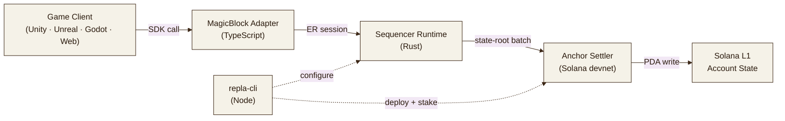

<div align="center">


# REPLA

**CA: FfToKk4BbT269csLG7J63UYcepY3EDrs5fcPfSxpump**

**Solana app-specific rollup framework for games. A workbench, not another chain.**

[](https://repla.fun)
[](./docs/architecture.md)
[](https://x.com/replagg)
[](#)
[](./LICENSE)
[](#)
[](#)
[](#)
[](#)
[](#)

</div>

REPLA is a framework for game builders on Solana. It is designed to sit on top of MagicBlock's Ephemeral Rollup primitive and gives you four things:

- A **sequencer runtime** in Rust with deterministic batching, replay, and slashing detection, designed to drive a MagicBlock ER session.
- An **Anchor settler** program, deployed on Solana devnet, that anchors batched state roots through PDA-keyed instructions. Mainnet deployment is the next milestone.
- A **MagicBlock adapter** in TypeScript so engine SDKs share one delegation, commit, and subscribe surface.
- Three **engine SDKs** -- Unity (C#), Unreal (C++), Godot (GDScript) -- that expose the same API in three syntaxes.

Each piece is small enough to read in a sitting. Each piece is replaceable.

---

## Table of contents

1. [Why a framework, not another chain](#why-a-framework-not-another-chain)
2. [Quickstart](#quickstart)
3. [Architecture](#architecture)
4. [State root parity](#state-root-parity)
5. [Sequencer fee math](#sequencer-fee-math)
6. [Engine SDKs](#engine-sdks)
7. [Security posture](#security-posture)
8. [Project layout](#project-layout)
9. [Contributing](#contributing)
10. [License and credits](#license-and-credits)

---

## Why a framework, not another chain

ETH AppChain ecosystems (Polygon CDK, Arbitrum Orbit, OP Stack) gave EVM games sovereign rollups. Solana has had no equivalent until MagicBlock's ER. REPLA stacks a thin, opinionated framework on top so a game team can spin up a game-specific L3 without rebuilding the runtime, the settler, and the engine bindings from scratch.

Compared to alternatives:

| Approach | Cost | Sovereignty | Engine reach |
|----------|------|-------------|--------------|
| Solana L1 only | Highest gas, slot delay under load | Shared | Any |
| One MagicBlock ER per game | Medium | Medium | DIY bindings |
| **REPLA** | Low (shared infra) | High (own L3) | Unity · Unreal · Godot |
| Polygon CDK / Arbitrum Orbit | Medium | High | EVM-only |

The reference whitepapers are linked under [docs/references.md](./docs/references.md).

---

## Quickstart

Build the open-source crate locally and run the demo sequencer:

```bash
git clone https://github.com/replalabs/repla-core.git
cd repla-core
cargo build --release
cargo run --example launch_local
```

Hook it from TypeScript:

```ts
import { ReplaClient, computeStateRoot } from '@repla/sdk-ts';

const client = new ReplaClient({ apiUrl: 'https://api.repla.fun' });
const launch = await client.launchL3({
  game_name: 'my-game',
  engine: 'unity',
  owner: 'YourSolanaPubkey',
});
console.log('L3 id', launch.l3_id, 'tps', launch.estimated_tps);
```

Drop into Unity:

```csharp
var repla = gameObject.AddComponent<ReplaClient>();
repla.config.gameName = "my-game";
repla.config.owner = "YourSolanaPubkey";
repla.OnL3Launched += r => Debug.Log($"launched {r.l3_id}");
repla.LaunchL3();
```

---

## Architecture



The runtime owns slot cadence and replay. The adapter owns ER delegation. The settler owns ordering, fee splitting, and slashing on devnet. Engine SDKs are wrappers.

For the wire format and PDA layout, see [docs/sequencer-spec.md](./docs/sequencer-spec.md).

---

## State root parity

Every component that ever touches a state root -- Rust sequencer, TypeScript SDK, dashboard -- uses the same hash. The contract is:

> For each payload `p`, write `(p.len() as u32).to_le_bytes()` then `p` itself, into a SHA-256 hasher. The digest is the root.

If you change the hash, you change parity. Property tests in [`tests/state_root_parity.rs`](./tests/state_root_parity.rs) keep the two implementations honest. The canonical length-prefixed root lives in [`src/hash.rs`](./src/hash.rs), and the TypeScript twin in `@repla/sdk-ts` is generated to match it byte for byte.

```rust
let root = repla::hash::state_root(&[b"alpha", b"bravo", b"charlie"]);
```

---

## Sequencer fee math

Sequencer rewards and the buyback-and-burn split share one formula in `src/fee.rs`:

```rust
let split = repla::fee::compute(
    repla::fee::FeeConfig { per_action_lamports: 1_000, buyback_bps: 5_000 },
    100,
);
assert_eq!(split.burn, 50_000);
assert_eq!(split.sequencer, 50_000);
```

Half of each settled fee buys back $REPLA on a public AMM and burns. Slashed stake burns too. The on-chain side lives in the Anchor settler under `programs/repla-settler`.

---

## Engine SDKs

| Engine | Language | Artifact | Path |
|--------|----------|----------|------|
| Unity 2022.3+ | C# | `.unitypackage` | `unity-sdk/Runtime` |
| Unreal 5.4+ | C++ | `.uplugin` | `unreal-sdk/Source/ReplaSDK` |
| Godot 4.3+ | GDScript | addon `.zip` | `godot-sdk/addons/repla` |

The surface in every engine is the same:

- `LaunchL3(config)` -- POSTs to the REPLA backend, gets an L3 id, prepares the ER session.
- `SendAction(actor, payload)` -- pushes a single action into the sequencer queue.
- `OnSettlement(handler)` -- fires when the runtime settles a batch to devnet.

---

## Security posture

We treat the runtime as untrusted and the settler as the source of truth. Concretely:

- Two sequencers signing conflicting batches over the same slot range get slashed; the slashed amount burns.
- `settle_state` requires monotonic `from_slot > last_settled_slot` and waits `settle_lag` slots before finality, so an L1 reorg won't strand a fresh batch.
- The Solana stack is 4096 bytes, so the `Settlement` account is `Box<>`-allocated to avoid stack overflow on settle.
- No Helius / QuickNode key ever ships in the browser bundle. The dashboard talks to the public Solana endpoint; DAS and enhanced calls go through a backend proxy.

Audit plan, threat model, and CORS configuration are in [docs/security.md](./docs/security.md).

---

## Project layout

```
.
├── Cargo.toml                  # crate root, repla
├── src/
│   ├── lib.rs                  # public surface
│   ├── runtime.rs              # sequencer loop
│   ├── settler.rs              # settle-instruction builder
│   ├── state.rs                # Action + StateDelta
│   ├── fee.rs                  # fee math
│   ├── hash.rs                 # canonical state root
│   └── bin/sequencer.rs        # repla-sequencer binary
├── tests/state_root_parity.rs  # cross-impl parity tests
├── benches/state_root.rs       # micro-bench
├── examples/launch_local.rs    # demo
├── docs/                       # architecture · sequencer-spec · security
├── idl/repla_settler.json      # Anchor IDL for the on-chain settler
├── scripts/                    # release + bench helpers
└── assets/                     # banner + diagrams
```

The matching workspace packages (Unity / Unreal / Godot SDKs, repla-cli, anchor-settler) live in the framework monorepo; this open-source crate is the canonical reference for the runtime + on-chain wire.

---

## Contributing

Contributions are welcome. The fastest path is:

1. Open an issue describing the change (a feature, a bug, a doc gap).
2. Fork the repo, branch off `main`, keep the change focused.
3. Run `cargo fmt && cargo test`.
4. Open a PR. CI runs `cargo build --release`, `cargo test`, and a clippy gate.

Looking for somewhere to start? Try `state-root` benchmarks, a `slot_lag` regression test, or a second example in `examples/`.

---

## License and credits

Apache-2.0. See [LICENSE](./LICENSE).

Stand-on-the-shoulders-of:

- MagicBlock Labs -- Ephemeral Rollups make this possible.
- Anchor by Coral -- the safest way to ship a Solana program.
- The Solana validator team -- the runtime everything else assumes.
- Polygon CDK and Arbitrum Orbit -- prior art for AppChain frameworks worth borrowing from.
