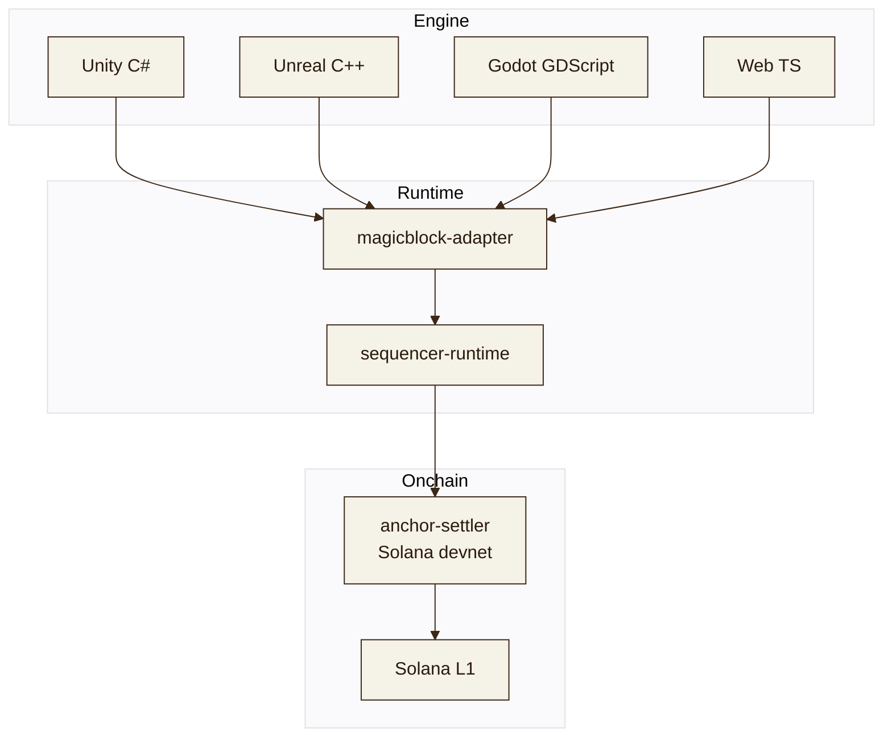

# Architecture

REPLA is four layers stacked on top of MagicBlock and your favorite engine.

## Why the layers

- **Engine SDKs** keep the same API surface across C#, C++, and GDScript so a game team isn't paying for a context-switch tax just to ship across platforms.
- **magicblock-adapter** is a thin binding over the published MagicBlock SDK, so engine SDKs don't need to know how the ER works under the hood.
- **sequencer-runtime** owns slot cadence, replay, and slashing detection. It's the only piece that touches game state directly.
- **anchor-settler** is the on-chain authority. It owns fee splitting, ordering, and slashing. Game state never lives here -- only the batched root.

## Why not bake game state on-chain

Three reasons:

1. The slot pressure model on Solana L1 is set by AMMs and oracles. A 60-tick combat loop sharing fee market with a derivative liquidation queue is bad for everyone.
2. An L3 lets the game pick a slot time, a settle cadence, and a sequencer set that match its loop -- without negotiating with the rest of Solana.
3. Cross-game composability still works because the settler is on devnet. Any other Solana program can read a settled root.
