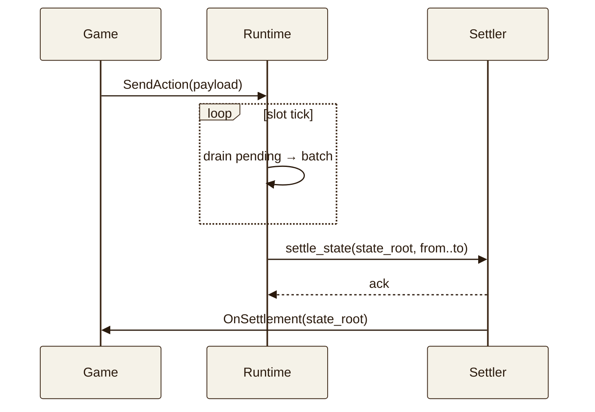

# Sequencer spec

## Wire frame

```
StateDelta {
  l3_id:        [u8; 32],
  from_slot:    u64,
  to_slot:      u64,
  state_root:   [u8; 32],
  action_count: u32,
}
```

Borsh-encoded, length-prefixed on the network.

## Settle instruction

The Anchor settler accepts:

```rust
pub struct SettleStateArgs {
    pub l3_id: [u8; 32],
    pub from_slot: u64,
    pub to_slot: u64,
    pub state_root: [u8; 32],
    pub action_count: u32,
}
```

Validation:

- `from_slot > l3.last_settled_slot` (monotonic)
- `to_slot >= from_slot` and `to_slot + settle_lag <= clock.slot`
- `sequencer.stake >= registry.min_stake`
- `sequencer.slash_count < registry.max_slashes`

## Fee flow

```
fee_total     = action_count * fee_per_action
fee_burn      = fee_total * buyback_bps / 10_000      # 50% by default
fee_sequencer = fee_total - fee_burn
```

## Slot diagram


